[//]: # "https://github.com/alinaimi/AKITS"

<!---
todo:
add codes
cleanup
-->

# AKITS
### AmirKabir Intelligent Transportation Systems Simulator. Developed by Alireza Naimi 2007
Some screenshots and videos of the software capabilities

---
Videos
=============

Screen Shots
=============

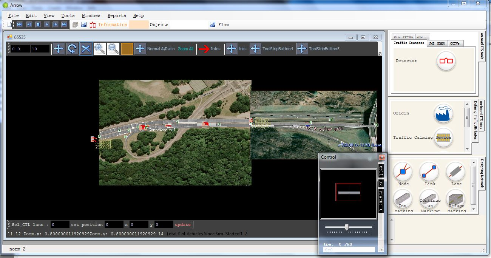
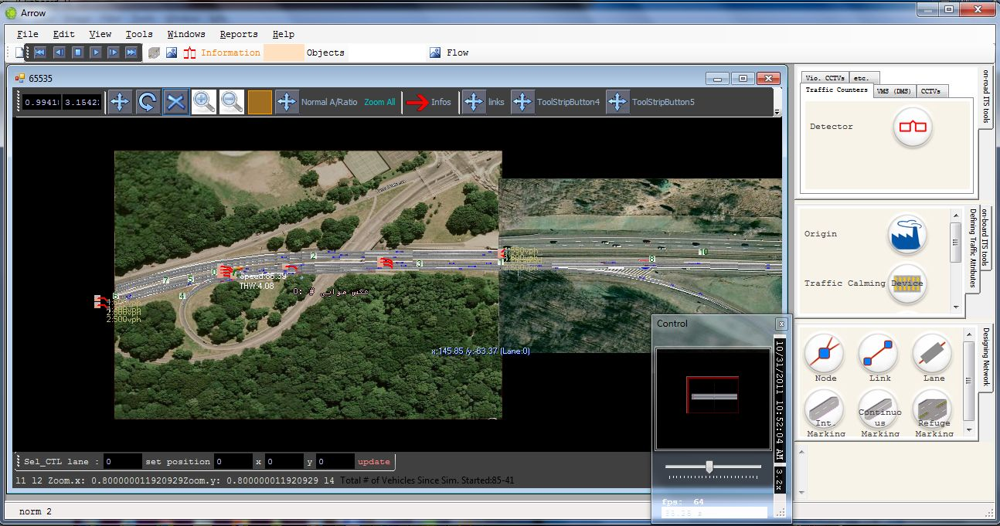
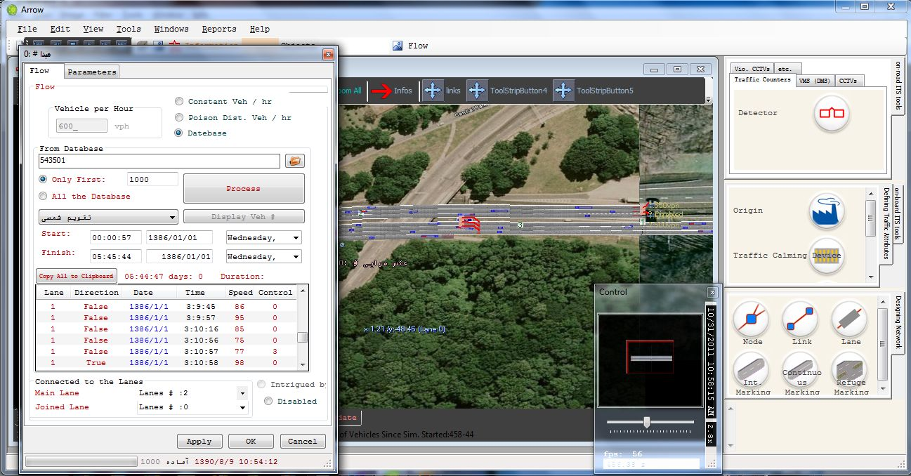
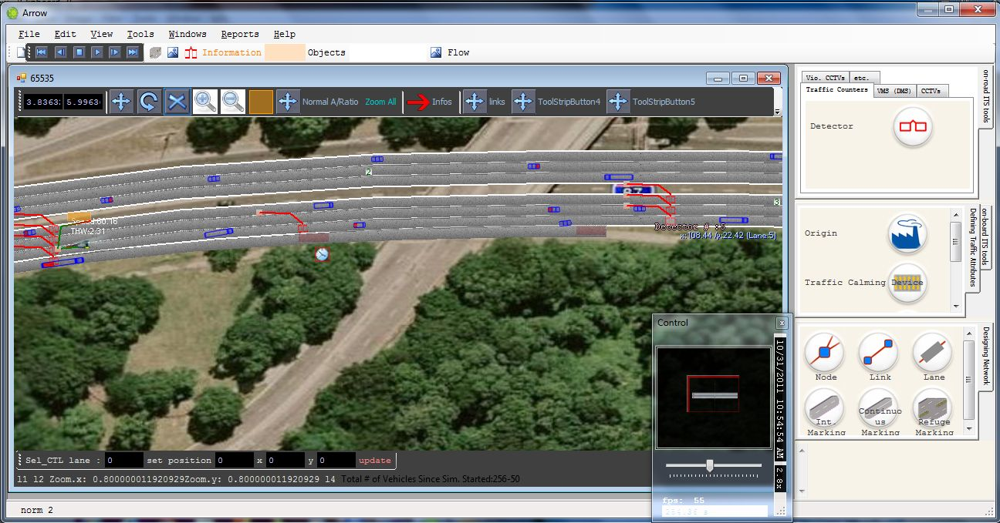
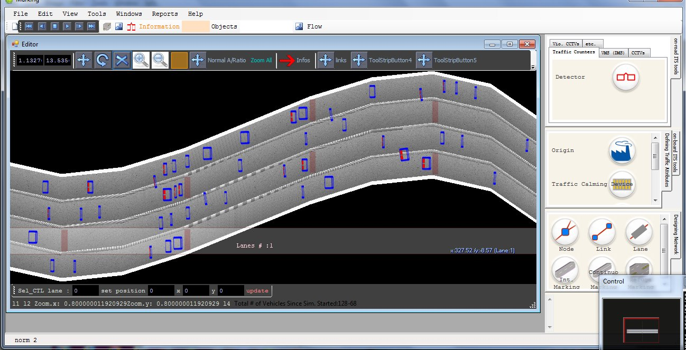
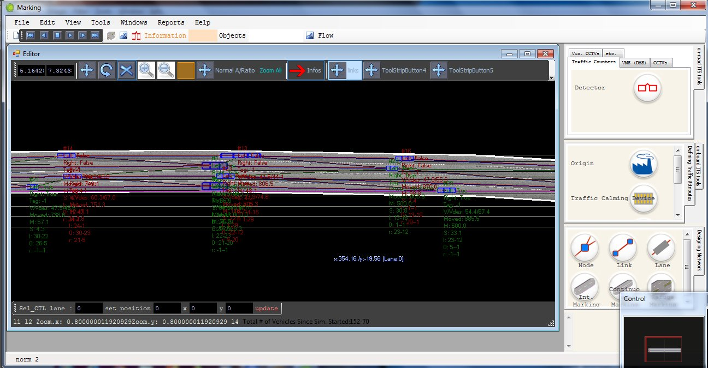
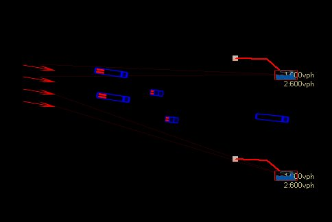
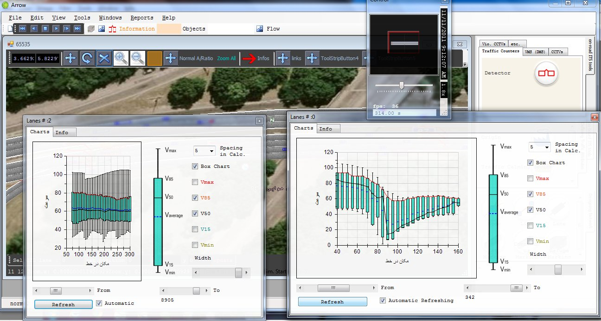
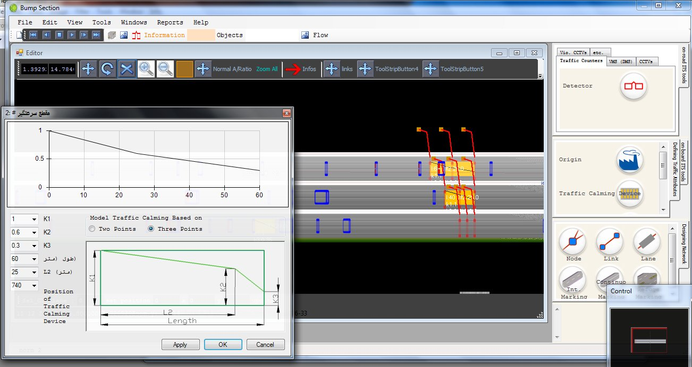
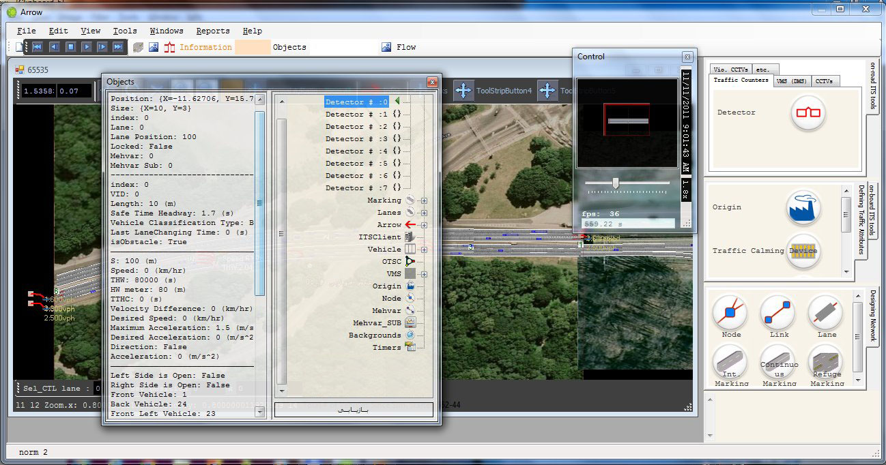
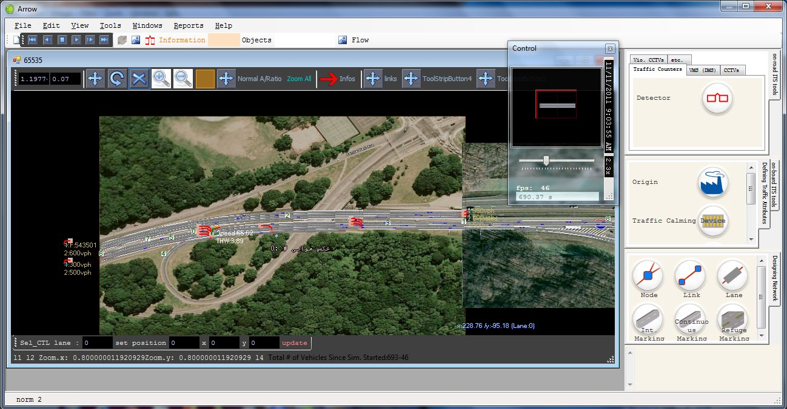
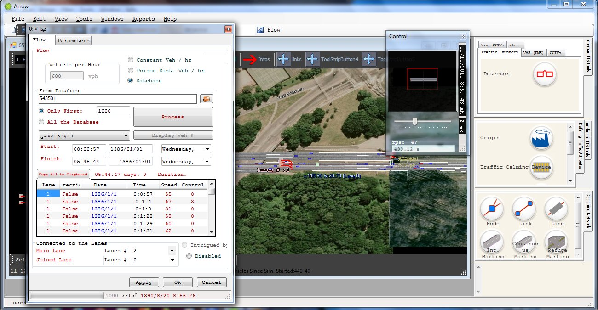
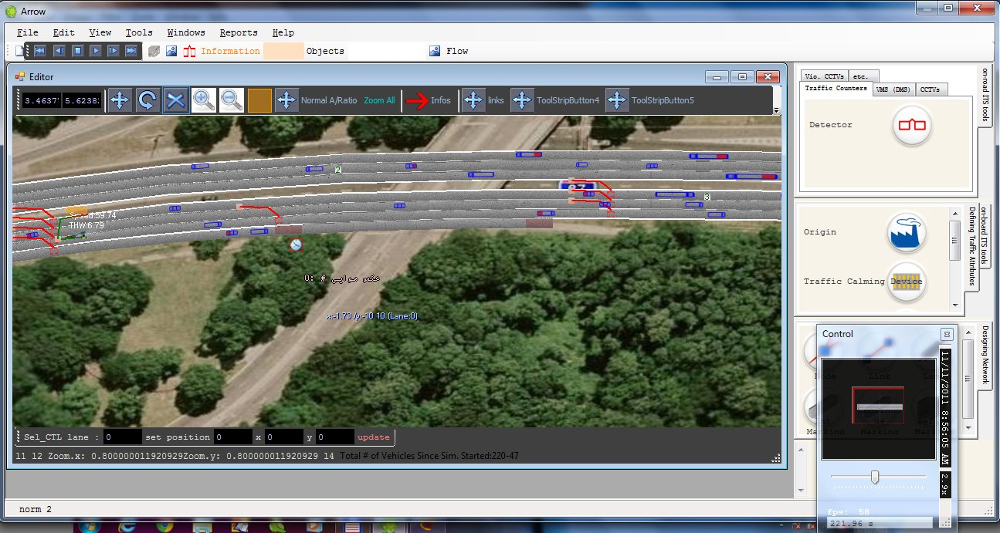
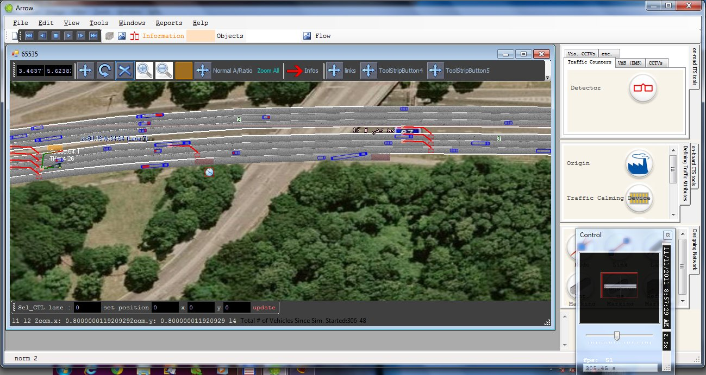
